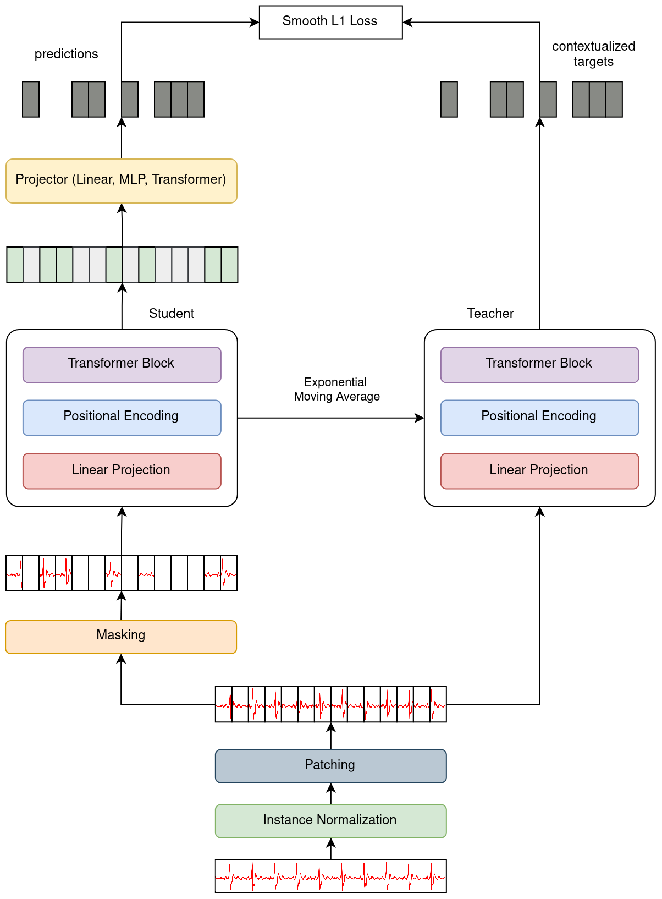

# Self-Supervised Representation Learning for Time Series Analysis

We propose a Time Series Joint Embedding Predictive Architecture (TS-JEPA) utilizing a self-distillation student-teacher setup.
While prior work has performed masked modeling in the input space, we are the first to investigate masked modeling for time series in the embedding space. A teacher encoder operates on the full input to generate contextualized target embeddings for the masked parts. Subsequently, a student encoder extracts meaningful representations from the unmasked input for the prediction of these target embeddings.

In our experiments, we examine the parameterization of the teacher encoder as a moving average of the student encoder to prevent mode collapse. TS-JEPA achieves results competitive with predominant SSL methods in time series forecasting and demonstrates state-of-the-art performance in ECG classification. Moreover, TS-JEPA exhibits promising transfer learning capacities.

## Dependencies
This repository works with Python 3.10 and PyTorch 1.13. Please create a virtual environment and install the dependencies specified in requirements.txt.

```bash
python3 -m venv ecg_analysis_env
source ecg_analysis_env/bin/activate
python3 -m pip install -r requirements.txt
```

## Datasets
We conduct experiments on the ECG classification dataset provided for the PhysioNet Challenge 2020 and on four popular forecasting datasets.
For each dataset, you can find a configuration file under `data/configs/`.

### ECG Classification
The [PhysioNet/Computing in Cardiology Challenge 2020](https://physionet.org/content/challenge-2020/1.0.2/) provided 43101 12-lead ECG recordings from six different sources. The sampling frequency of the recordings varies from 257 Hz to 1000 Hz, their individual length lies between 6 seconds and 30 minutes. In total, there are 111 labeled abnormalities, 27 of which are included in the official scoring metric.
Hence, we associate each recording with a multilabel target comprising 27 clinical diagnoses. We extract windows of 10 seconds at a random position from each recording and apply zero padding for smaller sequences. We sample the time series signal at a frequency of 100 Hz and normalize the ECG recordings, such that the signal of each channel lies within the range of -1 to 1. Following [Natarajan et al.](https://www.cinc.org/2020/Program/accepted/107_CinCFinalPDF.pdf), we provide the option to apply a Finite Impulse Reponse (FIR) bandpass filter with a bandwith between 3 - 45 Hz to attenuate noise. The dataset is split into train, validation, and test sets in an 8:1:1 ratio.

### Time Series Forecasting
We select eight multivariate datasets which are publicly available at the [Autoformer repository](https://github.com/thuml/Autoformer) and have been extensively used to benchmark the performance of forecasting algorithms. 
* The [Weather](https://www.bgc-jena.mpg.de/wetter/) dataset comprises 21 meteorological indicators, including air temperature, humidity, and air pressure, recorded in a German city at a temporal resolution of every 10 minutes throughout the entire year of 2020.
* The [Traffic](https://pems.dot.ca.gov/) dataset is provided by the California Department of Transportation and contains hourly road occupancy rates measured by various sensors deployed on freeways in the San Francisco Bay area.
* The [Electricity](https://archive.ics.uci.edu/ml/datasets/ElectricityLoadDiagrams20112014) dataset includes hourly electricity consumption data from 321 customers over three entire years, spanning from 2012 to 2014.
* The [ETT](https://github.com/zhouhaoyi/ETDataset) datasets depict the load and oil temperature of electric transformers. They are collected from two different devices, denoted as transformer 1 and 2, at two different resolutions (15 minutes and 1 hour), denoted as m and h, between July 2016 and July 2018. In total, this recording scheme yields four ETT datasets, namely ETTm1, ETTm2, ETTh1, and ETTh2.

Following [Wu et al.](https://arxiv.org/abs/2106.13008), the datasets are split into train, validation, and test sets in chronological order, with a ratio of 6:2:2 for the ETT dataset and 7:1:2 for the other datasets.


## Models
Inspired by the success of masked modeling in NLP and CV, [Nie et al.](https://arxiv.org/pdf/2211.14730.pdf) proposed the **Patch Time Series Transformer (PatchTST)**. Pre-training this Transformer model on time series patches according to the masked modeling paradigm yields state-of-the-art results in time series forecasting with a notable improvement over the fully supervised approach. PatchTST can also be pre-trained in a [BERT](https://arxiv.org/abs/1810.04805)-like manner with masked modeling.

To efficiently pre-train large Transformer models on images, [He et al.](https://arxiv.org/abs/2111.06377) introduced **Masked Autoencoders (MAE)**. This methods involves dividing an image into patches, with a substantial portion of patches being masked during pre-training. The encoder only operates on the visible subset of patches while the decoder reconstructs the original image from the latent representation and mask tokens. We adopt their approach for time series.

We are the first to propose a **Time Series Joint Embedding Predictive Architecture (TS-JEPA)** following [I-JEPA](https://arxiv.org/abs/2301.08243), [data2vec](https://arxiv.org/abs/2202.03555) and [data2vec 2.0](https://arxiv.org/abs/2212.07525). We incorporate the PatchTST channel independence assumption and [RevIN](https://openreview.net/pdf?id=cGDAkQo1C0p) to mitigate temporal distribution shift for non-stationary time series.

<p align="center">
  
</p>

**Time Series Joint Embedding Predictive Architecture (TS-JEPA)**. Each univariate time series is standard normalized and divided into a sequence of patches. 
The teacher network $f_\lambda$ is provided with the original sequence to compute contextualized representations for the masked patches.
The student network $f_\theta$ operates on the sequence of masked and unmasked patches and extracts characteristic representations. These representations are used by the predictor $g_\phi$ to regress the contextualized targets. To prevent a mode collapse, the teacher encoder is parameterized as an exponential moving average of the student encoder. TS-JEPA can be trained with a Smooth L1 loss. 


## Training
The `slurm/` folder contains scripts to train the models on a SLURM-compatible compute system. Check out `options.py` to gain an overview of the training parameters.

To train a particular model, you have to provide the `--model_name` and define its configuration. Supervised models can be trained for two tasks: `classification` or `forecasting`. If you are interested in unsupervised models, you can pre-train them by selecting the task `pretraining`. Once you have a pre-trained model, you can fine-tune it for a supervised task. Load the pre-trained model with the `--load_model` flag.

To patch the time series input, please set the `--use_patch` flag and specify `--patch_len` and `--stride`.


### Pre-training
The pre-training of our TS-JEPA model with an MLP predictor on time series with a masking ratio of 50 % and non-overlapping patches of size 8 can be initiated with the following command.

```bash
python3 main_pretrain.py \
--model_name tsjepa \  # alternatively: patchtst, mae
--enc_num_layers 8 \
--enc_num_heads 16 \
--enc_d_model 128 \
--enc_mlp_ratio 2 \
--predictor mlp \  # alternatively: linear, transformer
--dec_d_model 128 \
--dec_mlp_ratio 2 \
--dropout 0.2 \
--activation_drop_rate 0.2 \
--attn_drop_rate 0 \
--head_dropout 0 \
--norm LayerNorm \
--layer_norm_first \
--activation gelu \
--ema_decay 0.9999 \
--ema_end_decay 1.0 \
--ema_anneal_end_step 2000 \
--targets_rep encoder_out \  # altenatively: ffn
--normalize_targets \
--targets_norm LayerNorm \
--masking random \  # alternatively: block
--masking_ratio 0.5 \
--use_patch \
--patch_len 8 \
--stride 8 \
--optimizer AdamW \
--lr 0.00001 \
--scheduler CosineAnnealingLR \
--epochs 2000 \
--weight_decay 0.01 \
--batch_size 1024 \
--num_workers 4 \
--patience 2000 \
--data_config data/configs/ecg.yaml \
--task pretraining \
--output_dir output \
--val_interval 10 \
--plot_interval 50 \
--vbcreg \
--pred_weight 1 \
--std_weight 0 \
--cov_weight 0 \
--loss smoothl1 \  # alternatively: mse
--smoothl1_beta 0.5
```

TS-JEPA can be trained with three different predictors (`mlp`, `linear`, `transformer`) by setting the `--predictor` flag accordingly. Here, the teacher encoder output after the final layer (`encoder_out`) is used as contextualized target and the model is trained with a Smooth L1 loss (`smoothl1`).

### Finetuning
To finetune a pre-trained TS-JEPA model for ECG classification, please adapt the following command. Without loading a pre-trained model, this command can also be used to start a fully supervised Transformer training. For linear probing, fix the weights of the pre-trained encoder with `--freeze`.

```bash
python3 main_finetune.py \
--model_name tsjepa \
--enc_num_layers 8 \
--enc_num_heads 16 \
--enc_d_model 128 \
--enc_mlp_ratio 2 \
--dropout 0.2 \
--activation_drop_rate 0.2 \
--attn_drop_rate 0 \
--head_dropout 0 \
--norm LayerNorm \
--layer_norm_first \
--activation gelu \
--learn_pe \
--use_patch \
--patch_len 8 \
--stride 8 \
--optimizer AdamW \
--lr 0.0001 \
--weight_decay 0.01 \
--scheduler CosineAnnealingLR \
--epochs 100 \
--batch_size 32 \
--num_workers 4 \
--patience 10 \
--data_config data/configs/ecg.yaml \
--task classification \
--val_interval 2 \
--output_dir output \
--load_model  # provide path to pre-trained model
```


## Acknowledgements

We appreciate the following websites and repositories for their valuable code base and datasets:

* https://physionet.org/content/challenge-2020/1.0.2/
* https://github.com/physionetchallenges/evaluation-2020
* https://github.com/thuml/Autoformer
* https://github.com/gzerveas/mvts_transformer
* https://github.com/yuqinie98/PatchTST
* https://github.com/facebookresearch/mae
* https://github.com/facebookresearch/ijepa
* https://github.com/facebookresearch/fairseq
* https://github.com/arxyzan/data2vec-pytorch


## Contact

If you have any questions or concerns, please feel free to contact me: simon.roschmann@tum.de